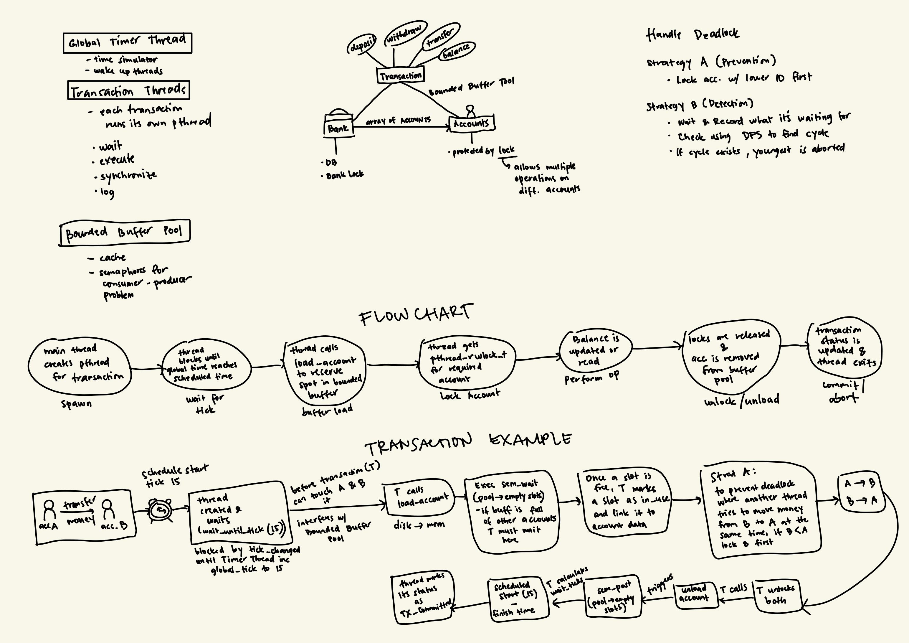

# Concurrent Banking (CMSC 125 Lab 3)

## Flowchart

## Build

From bankdb/ directory:

	make clean
	make

Debug build (ThreadSanitizer):

	make debug

Run all provided tests:

	make test

ThreadSanitizer check (manual):

	make debug
	./bin/bankdb --accounts=tests/accounts.txt --trace=tests/trace_readers.txt --deadlock=prevention --tick-ms=100

## Usage

Required flags:

	./bin/bankdb --accounts=tests/accounts.txt --trace=tests/trace_simple.txt --deadlock=prevention --tick-ms=100

Optional flags:

- --verbose (print per-tick logs)

## Features Implemented

- Multi-threaded transaction execution with timer thread
- Per-account reader-writer locks
- Deadlock prevention via lock ordering
- Bounded buffer pool with semaphores
- Final report with conservation check and transaction status

## Known Limitations

- Deadlock detection strategy is not implemented (prevention only)
- Account lookup is linear by account_id

## Run Tests (manual)

	./bin/bankdb --accounts=tests/accounts.txt --trace=tests/trace_simple.txt --deadlock=prevention --tick-ms=100
	./bin/bankdb --accounts=tests/accounts.txt --trace=tests/trace_readers.txt --deadlock=prevention --tick-ms=100
	./bin/bankdb --accounts=tests/accounts.txt --trace=tests/trace_abort.txt --deadlock=prevention --tick-ms=100
	./bin/bankdb --accounts=tests/accounts.txt --trace=tests/trace_deadlock.txt --deadlock=prevention --tick-ms=100
	./bin/bankdb --accounts=tests/accounts.txt --trace=tests/trace_buffer.txt --deadlock=prevention --tick-ms=100

## Extra Tests (manual)

	./bin/bankdb --accounts=tests/accounts.txt --trace=tests/trace_abort_mid.txt --deadlock=prevention --tick-ms=100
	./bin/bankdb --accounts=tests/accounts.txt --trace=tests/trace_rw_mix.txt --deadlock=prevention --tick-ms=100

## Screenshots and Logs

Add required proofs to the screenshot/ folder and link them here:

- ThreadSanitizer zero warnings: screenshot/tsan_readers.png
- Deadlock prevention verbose run: screenshot/deadlock_prevention_verbose.png
- Buffer pool blocking (trace_buffer): screenshot/buffer_pool_blocking.png
- Conservation check: screenshot/conservation_check.png